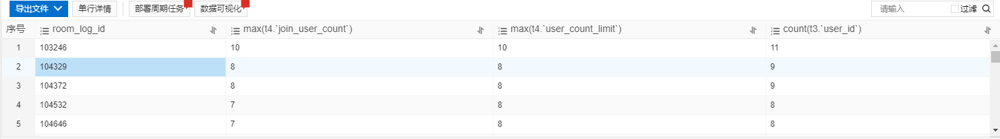

&emsp;&emsp;一个在生产环境运行的红包接龙小游戏发生了问题。
<!--more-->
## 现象
&emsp;&emsp;小游戏的逻辑很简单，首先开一个空的红包房间，用户进入房间扣除保证金，房间人满后开奖，除了获奖最低的那个人之外，返还其他人的保证金。

&emsp;&emsp;今天客户提了个bug，就是在极少数情况下，开奖后前端显示用户获得的奖品数量为0，这个用户与另一个获得奖品数量非0但最低的用户，都没有退还保证金。

&emsp;&emsp;接到报告的时候是晚上，当时我下意识的以为是随机发放奖品的算法出了问题，想着第二天把算法跑10w遍，确定有问题，修改算法逻辑就可以了。

&emsp;&emsp;但是第二天当我查阅数据库记录时发现有不对劲的地方

&emsp;&emsp;首先我查看了项目上线为止，到现在一共有多少条用户获得奖品数量为0的记录：


&emsp;&emsp;大概45条，这个比例在23w条记录中不算高

&emsp;&emsp;接着我筛选出其中某一轮游戏的所有参与者，查询这些参与者的收支记录，以便确认有多少用户需要多退少补。

&emsp;&emsp;这里看到的情况与客户描述的一致，只有获得奖品数量为0的用户和获得奖品数量大于0但此轮用户中获奖最少的用户，他们俩没有退还保证金，其他用户收支正常，为了简略，我们把这两个用户分别称为 A 和 B

&emsp;&emsp;这里我发现了古怪的地方。

&emsp;&emsp;我们设定三个字段
 1. 加入房间人数
 2. 房间最大人数
 3. 实际加入房间人数

&emsp;&emsp;以下是从数据库中查出的情况：


## 思路
&emsp;&emsp;这张图展示了一个问题：

&emsp;&emsp;为什么加入房间人数和实际加入房间人数会不一致？
   - 直觉告诉我这个是核心问题，解决了它其他问题很可能就不攻自破了。
   - 猜测1：
	 + 很明显的会让人想到并发问题。是不是因为，在加入房间的时候对并发处理的不完善，导致了这个问题？
	 + 查看加入房间的代码
```
// 加入游戏接口，用户在红包房间页面点击抢红包按钮时调用
func JoinHandle(w http.ResponseWriter, r *http.Request) {
	var err error
	defer func() {
		if err != nil {
			_ = renderJson(w, err.Error(), err.Error(), -1)
		}
	}()
	err = r.ParseForm()
	if err != nil {
		return
	}

	userId, err := getUserId(r)
	if err != nil {
		return
	}

	curRoomData, err := redis.GetCurRoomData()
	if err != nil {
		return
	}

	if curRoomData.Status != redis.RoomWaitStatus {
		err = fmt.Errorf("还不能加入房间！")
		return
	}

	dbInstance, _ := db.Instance()
	tx, err := dbInstance.Begin()
	defer func(tx *sql.Tx) {
		if err != nil {
			_ = tx.Rollback()
		}
	}(tx)

	joinUserList := []uint{userId}
    
	_, err = db.AddUndoneUserLog(tx, curRoomData, joinUserList)
	if err != nil {
		return
	}

	joinUserCount, err := redis.AddUserByLua(userId)
	if err != nil {
		return
	}

	// 做扣费处理
	err = rpc.SetUserMoney(userId, curRoomData.Base_money*-1)
	if err != nil {
		err = fmt.Errorf("金币不足！")
		_ = redis.DelUser(userId)
		return
	}

	err = tx.Commit()
	if err != nil {
		_ = redis.DelUser(userId)
		return
	}

	if uint(joinUserCount) == curRoomData.User_count_limit {
		_ = subscriber.Publish(subscriber.RoomFullTopic, "")
	}

	_ = mqtt.GameUserJoinRoom(curRoomData, uint(joinUserCount))

	_ = renderJson(w, "", "加入游戏接口接口访问成功！", 1)
}
```
   - 其中
```
_, err = db.AddUndoneUserLog(tx, curRoomData, joinUserList)
```
   - 这一行代表将用户插入数据库，也即**实际加入房间人数**

```
joinUserCount, err := redis.AddUserByLua(userId)
if err != nil {
	return
}
```
   - 而这一行代表用户加入房间成功，也即影响到**加入房间人数**

## 深入思考

&emsp;&emsp;到这一步，我们能把问题继续分解为两个子问题：
1. 为什么在加入房间人数小于房间最大人数的情况下，游戏还能够成功触发结算。
2. 为什么在加入房间人数已经等于房间最大人数的情况下，会继续插入用户记录，导致实际加入房间人数大于房间最大人数。

&emsp;&emsp;一个个来，先解决第一个问题。

&emsp;&emsp;猜测1：
- 在读取加入房间人数时，实际上读取的是redis中set集合的长度。而用户加入房间，也即把用户id加入到这个集合中。会不会有脏读的情况，即当一个redis连接对set数据进行修改时，另一个redis连接在查询这个数据，导致读到的数据是修改完成前的数据。

- 我们先查询一下，redis是否有可能出现脏读情况。

- 很遗憾，没搜索到什么有用的信息。我只能结合当前应用场景做测试。

- 在AddUserByLua的lua脚本中，加入sleep，然后另起一个连接，读取数据，看看是阻塞知道读到修改后的数据，还是直接读到修改前的数据。

- 测试失败

- 实际上从AddUserByLua开始，到
```
_ = subscriber.Publish(subscriber.RoomFullTopic, "")
```
- 触发结算事件。

- 这段代码是同步执行的，即当触发结算时，lua脚本必定执行完了，除非将AddUserByLua脚本放在goroutine中执行，才会产生预想的效果。

&emsp;&emsp;猜测2：
- 用户A执行AddUserByLua成功用户被成功加入，但是在扣费时失败了。这个时候来了用户B
，正好这次用户B触发了结算，进入结算流程。可用户a的逻辑往下执行时做了:
```
_ = redis.DelUser(userId)
```
- 操作

- 导致用户B在结算时少了一个用户，因为这个用户就是用户A，他被自己的异常处理流程删除了。

- 这个猜想能很好的解释问题1。

- 接下来我们尝试复现：模拟两个用户，其中用户a金币不足，且在结算失败流程中delay5秒，在用户a触发金币不足时，开始用户b逻辑，在结算触发刚开始时，delay5秒，这个时候应该由a完成异常处理，将自己从用户列表中删除，最后查看结算状态，是否符合问题1的情况。

- 成功验证了这个猜测

- 解决方案：
  + 利用redis做分布式全局锁，保证一个请求在执行DelUser时，不会有另一个请求正好触发房间人数满的事件。
  + 以下是修改过后的代码。
```
// 加入游戏接口，用户在红包房间页面点击抢红包按钮时调用
func JoinHandle(w http.ResponseWriter, r *http.Request) {
	var err error
	defer func() {
		if err != nil {
			_ = renderJson(w, err.Error(), err.Error(), -1)
		}
	}()
	err = r.ParseForm()
	if err != nil {
		return
	}

	userId, err := getUserId(r)
	if err != nil {
		return
	}

	curRoomData, err := redis.GetCurRoomData()
	if err != nil {
		return
	}

	if curRoomData.Status != redis.RoomWaitStatus {
		err = fmt.Errorf("还不能加入房间！")
		return
	}
	// 获取锁
	lock, err := redis.SetLock("red_envelope_join", 30)
	if err != nil {
		return
	}

	if !lock {
		err = fmt.Errorf("网络出错，请重试！")
		return
	}
	defer func(lock bool) {
		// 释放锁
		if lock {
			_ = redis.UnLock("red_envelope_join")
		}
	}(lock)

	joinUserCount, err := redis.AddUserByLua(userId)
	if err != nil {
		return
	}

	dbInstance, _ := db.Instance()
	tx, err := dbInstance.Begin()
	defer func(tx *sql.Tx) {
		if err != nil {
			_ = tx.Rollback()
			_ = redis.DelUser(userId)
		}
	}(tx)

	joinUserList := []uint{userId}

	_, err = db.AddUndoneUserLog(tx, curRoomData, joinUserList)
	if err != nil {
		return
	}

	// 做扣费处理
	err = rpc.SetUserMoney(userId, curRoomData.Base_money*-1)
	if err != nil {
		err = fmt.Errorf("金币不足！")
		return
	}

	err = tx.Commit()
	if err != nil {
		return
	}

	if uint(joinUserCount) == curRoomData.User_count_limit {
		_ = subscriber.Publish(subscriber.RoomFullTopic, "")
	}

	_ = mqtt.GameUserJoinRoom(curRoomData, uint(joinUserCount))

	_ = renderJson(w, "", "加入游戏接口接口访问成功！", 1)
}
```
- 修改完成后部署上线，在接下来的三天中，都没有发现异常数据。
- 神奇的是，问题2也不再出现了。
- 故障处理完毕！

## 总结
&emsp;&emsp;并发故障总是web开发中最难以解决的问题。难以复现不说，一旦出现还可能造成严重后果。

&emsp;&emsp;并且还伴随着解决方案的取舍问题。串行化可能会导致并发性能快速下降，怎么改，在哪改，改出更严重的问题怎么办？非常让人头疼。

&emsp;&emsp;但是自己写的bug，怎么着也得硬着头皮上，直面难题是解决难题的唯一途径。

&emsp;&emsp;分解问题是个好方法。特别是当现象显得错综复杂时，将问题分解，一步步解决，可以说是最好的方式了。

&emsp;&emsp;发现问题，描述现象，查找资料，理解原理，复现问题，解决问题。
